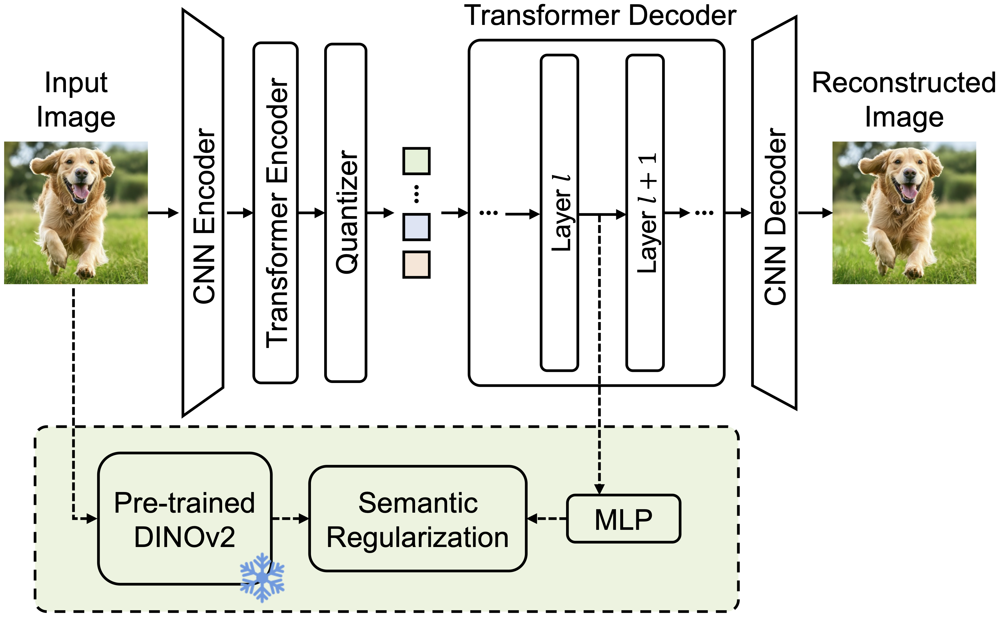

# GigaTok: Scaling Visual Tokenizers to 3 Billion Parameters for Autoregressive Image Generation


<div align="center">

[]()&nbsp;
[](https://silentview.github.io/GigaTok/)&nbsp;
</div>


<p align="center">

<p>

<div align="center">
  <a href="https://scholar.google.com/citations?user=tTMKGSYAAAAJ&hl" target="_blank">Tianwei&nbsp;Xiong</a><sup>1*</sup> &ensp; <b>&middot;</b> &ensp;
  <a href="https://scholar.google.com.sg/citations?user=8gm-CYYAAAAJ&hl=en" target="_blank">Jun&nbsp;Hao&nbsp;Liew</a><sup>2</sup> &ensp; <b>&middot;</b> &ensp;
  <a href="https://speedinghzl.github.io/" target="_blank">Zilong&nbsp;Huang</a><sup>2</sup> &ensp; <b>&middot;</b> &ensp;
  <a href="https://scholar.google.com.sg/citations?user=Q8iay0gAAAAJ&hl" target="_blank">Jiashi&nbsp;Feng</a><sup>2</sup> &ensp; <b>&middot;</b> &ensp;
  <a href="https://xh-liu.github.io/" target="_blank">Xihui&nbsp;Liu</a><sup>1✉</sup><br>
  <sup>1</sup>The University of Hong Kong &emsp; <sup>2</sup>ByteDance Seed &emsp; <br>
  <sup>*</sup>Work partly done as an Intern at ByteDance. ✉ Corresponding author &emsp; <br>
</div>
<br>


## 🔈News

- [2025/04/12] Research paper, code, and models are released for GigaTok!


## Introduction


<p align="center">

<p>


We introduce **GigaTok**, the first method for scaling visual tokenizers to 3 billion parameters. We reveal that *reconstruction vs. generation dilemma* for scaling tokenizers is caused by increasing latent space complexity. And it can be resolved by semantic regularization. And to scale up a visual tokenizer to 3B:
  - 1D tokenizers are more scalable than 2D tokenizers. 
  - It is better prioritizing decoder scaling when expanding both encoder and decoder.
  - Entropy loss helps stabilize training for billion-scale tokenizers.


🚀 In this codebase, we release
- A series of tokenizers ranging from 136M to 3B, with AR models trained on them.
- A comprehensive framework for experimental exploration of tokenizer training and evaluation, beyond reconstruction target.

<p align="center">

<p>


## Environment Setup

To set up the environment for Gigatok, follow these steps:

```shell
# A working CUDA version: 12.1
# Correspond to TORCH_RUN_PATH in set_env_vars.sh
conda create -n gigatok python=3.9
conda activate gigatok
# Install required packages using the provided script
bash env_install.sh
```

## Download Checkpoints

All the tokenizers are for 256x256 images.

| Tokenizer       |  Config   | Param. (Tokenizer) | rFID | LPIPS  | Tokenizer Download Link                                                                                        | AR Model | Param. (AR) | gFID | Acc.  | AR Model Download Link                                                                                                    |
| --------------- | --- | ------------------ | ---- | ------ | -------------------------------------------------------------------------------------------------------------- | -------- | ----------------- | ---- | ----- | ------------------------------------------------------------------------------------------------------------------------- |
| S-S             |   [VQ_SS256.yaml](configs/vq/VQ_SS256.yaml)  | 136M               | 1.01 | 0.2226 | [VQ_SS256_e100.pt](https://drive.google.com/file/d/1Q_WHCT6mdNnu0GkHCm0CbXaP6kFeTe5h/view?usp=sharing)         | GPT-B    | 111M              | 4.05 | 62.6% | [GPT_B256_e300_VQ_SS.pt](https://drive.google.com/file/d/1VTaBPP-UUE6wc148vQQejfYNVjyYm4IS/view?usp=sharing)              |
| S-B             |   [VQ_SB256.yaml](configs/vq/VQ_SB256.yaml)  | 232M               | 0.89 | 0.2121 | [VQ_SB256_e200.pt](https://drive.google.com/file/d/17K-h2Jwep53RUEf6CEOV3ro7Cz_DaIWC/view?usp=sharing)         | GPT-B    | 111M              | 3.83 | 62.9% | [GPT_B256_e300_VQ_SB.pt](https://drive.google.com/file/d/1aeMpU5ybvs0s5wsuhBoTZDhYYc4WHZh7/view?usp=sharing)              |
| B-L             |   [VQ_BL256.yaml](configs/vq/VQ_BL256.yaml)  | 622M               | 0.81 | 0.2059 | [VQ_BL256_e200.pt](https://drive.google.com/file/d/1VnBu4aj0N7lFa1_wKBdTgLNZmaNgFvwi/view?usp=sharing)         | GPT-B    | 111M              | 3.26 | 67.6% | [GPT_B256_e300_VQ_BL.pt](https://drive.google.com/file/d/1ZiRAk9pHhcrrbVMP1qSf4rDfSJMCsY6Y/view?usp=sharing)              |
| B-L (dino disc) |  [VQ_BL256_dino_disc.yaml](configs/vq/VQ_BL256_dino_disc.yaml)   | 622M               | 0.51 | 0.2056 | [VQ_BL256_dino_disc.pt](https://drive.google.com/file/d/11bXyg6y15hIWYnIsl7YbwDtRAJMK7jjn/view?usp=drive_link) | GPT-B    | 111M              | 3.33 | 67.7% | [GPT_B256_e300_VQ_BL_dino_disc.pt](https://drive.google.com/file/d/1BckVcQ7NPipa8tjAazwBy0usJnO8pdHp/view?usp=drive_link) |
| XL-XXL          |   [VQ_XLXXL256.yaml](configs/vq/VQ_XLXXL256.yaml)  | 2.9B               | 0.79 | 0.1947 | [VQ_XLXXL256_e300.pt](https://drive.google.com/file/d/1HK_bV_zklLfGmIHGE4gMwjfhLLKi6Z3G/view?usp=sharing)      | GPT-B    | 111M              | 3.15 | 72.0% | [GPT_B256_e300_VQ_XLXXL.pt](https://drive.google.com/file/d/1zIIy6TVo8WIHiGKFp83CfyFaUytFQ1uR/view?usp=sharing)           |


**Larger AR models Downloading**

| Tokenzier |  Config   | AR Model | Param. (AR) | gFID | Acc.  | AR Model Download Link                                                                                            |
| --------- | --- | -------- | ----------------- | ---- | ----- | ----------------------------------------------------------------------------------------------------------------- |
| B-L       |   [VQ_BL256.yaml](configs/vq/VQ_BL256.yaml)  | GPT-XL   | 775M              | 2.13 | 70.6% | [GPT_XL256_e300_VQ_BL.pt](https://drive.google.com/file/d/1ABRaQ8h-mv-JE6gHlAnTPUJTlbd25yQt/view?usp=sharing)     |
| B-L       |   [VQ_BL256.yaml](configs/vq/VQ_BL256.yaml)  | GPT-XXL  | 1.4B              | 2.03 | 69.4% | [GPT_XXL256_e300_VQ_BL.pt](https://drive.google.com/file/d/1qC1wkF99IV2cptGR_ALuqqXz0oKBiKp9/view?usp=sharing)    |
| XL-XXL    |   [VQ_XLXXL256.yaml](configs/vq/VQ_XLXXL256.yaml)  | GPT-XXL  | 1.4B              | 1.98 | 74.0% | [GPT_XXL256_e300_VQ_XLXXL.pt](https://drive.google.com/file/d/1yMPOYx3oR1PZpZynEotQAO720UVxL0iL/view?usp=sharing) |


## Inference and Evaluation

### Tokenizer Reconstruction

To perform tokenizer reconstruction, you need to set up the required environment variables and run the reconstruction script. Follow the instructions below:

1. **Set Environment Variables**  
Modify the `set_env_vars.sh` script according to the comments in it. For this reconstruction task, you only need to specify the following variables:
PROJECT_ROOT and TORCH_RUN_PATH. 
```shell
# Define the required path/env related variables
. set_env_vars.sh

# Choose the tokenizer configuration

# For S-S Tokenizer (128M)
export TOK_CONFIG="configs/vq/VQ_SS256.yaml"
export VQ_CKPT=results/recheck/VQ_SS256_e100.pt

# Uncomment the following for S-B (232M)
# export TOK_CONFIG="configs/vq/VQ_SB256.yaml"
# export VQ_CKPT=results/recheck/VQ_SB256_e200.pt

# Uncomment the following for B-L (622M)
# export TOK_CONFIG="configs/vq/VQ_BL256.yaml"
# export VQ_CKPT=results/recheck/VQ_BL256_e200.pt

# Uncomment the following for B-L (dino disc) (622M)
# export TOK_CONFIG="configs/vq/VQ_BL256_dinodisc.yaml"
# export VQ_CKPT=results/ckpts/VQ_BL256_dino_disc.pt


# Uncomment the following for XL-XXL (2.9B)
# export TOK_CONFIG="configs/vq/VQ_XLXXL256.yaml"
# export VQ_CKPT=results/ckpts/VQ_XLXXL256_e300.pt
```

2. **Run the Qualitative Reconstruction Script**  
```shell
DATA_PATH=${PROJECT_ROOT}/tests/
# this is the output directory
SAMPLE_DIR=results/reconstructions/

gpus=1 \
PORT=11086 \
bash scripts/reconstruction.sh \
--quant-way=vq \
--data-path=${DATA_PATH} \
--image-size=256 \
--sample-dir=$SAMPLE_DIR \
--vq-ckpt=${VQ_CKPT} \
--model-config ${TOK_CONFIG} \
--qualitative \
--lpips \
--clear-cache
```

For the quantitative reconstruction evaluation, see [Detailed_instructions](Detailed_instructions.md)

### AR Model Inference for class-conditional generation

**Qualitative Sampling**
```shell
# Try these classes!
# [388]='giant panda, panda, panda bear, coon bear, Ailuropoda melanoleuca'
# [90]='lorikeet'
# [323]='monarch, monarch butterfly, milkweed butterfly, Danaus plexippus'
# [84]='peacock'
# [980]='volcano'
# [977]='sandbar, sand bar'
# [978]='seashore, coast, seacoast, sea-coast'
# [979]='valley, vale'
# [972]='cliff, drop, drop-off'
# [105]='koala, koala bear, kangaroo bear, native bear, Phascolarctos cinereus'
# [22]='bald eagle, American eagle, Haliaeetus leucocephalus'

. set_env_vars.sh

export TOK_CONFIG="configs/vq/VQ_XLXXL256.yaml"
export VQ_CKPT=results/ckpts/VQ_XLXXL256_e300.pt

export LM_CKPT=results/ckpts/GPT_B256_e300_VQ_XLXXL.pt
CFG=4.0
CFG_SCHEDULE="constant"
GPT_MODEL="GPT-B"
SAMPLE_DIR=results/gpt_eval/GPT_B256_e300_VQ_XLXXL

# Uncomment for testing GPT-XXL
# export LM_CKPT=results/ckpts/GPT_XXL256_e300_VQ_XLXXL.pt
# CFG=4.0
# CFG_SCHEDULE="constant"
# GPT_MODEL="GPT-XXL"
# SAMPLE_DIR=results/gpt_eval/GPT_XXL256_e300_VQ_XLXXL

# sample results: 
bash scripts/sample_c2i_visualization.sh \
--quant-way=vq \
--image-size=256 \
--sample-dir=$SAMPLE_DIR \
--vq-ckpt  ${VQ_CKPT} \
--tok-config ${TOK_CONFIG} \
--gpt-model ${GPT_MODEL} \
--cfg-schedule ${CFG_SCHEDULE} \
--cfg-scale ${CFG} \
--gpt-ckpt ${LM_CKPT} \
--precision fp16 \
--class-idx "22,388,90,978" \
--per-proc-batch-size 8 \
--qual-num 40
```

For the quantitative evaluation, see [Detailed_instructions](Detailed_instructions.md)


### Linear Probing Evaluation
See [Detailed_instructions](Detailed_instructions.md)

## Detailed Evaluation and Training Scripts
See [Detailed_instructions](Detailed_instructions.md)

## Acknowledgements

- The authors sincerely thank <a href="https://yucornetto.github.io/">Qihang Yu</a> and <a href="http://liangchiehchen.com/">Liang-Chieh Chen</a> for their valuable discussions during the development of GigaTok.

- This codebase is built on [LlamaGen](https://github.com/FoundationVision/LlamaGen). Important reference codebases for this project include [REPA](https://github.com/sihyun-yu/REPA), [DETR](https://github.com/facebookresearch/detr).

- We also include some experimental implementation from [vaex](https://github.com/FoundationVision/vaex), [vector-quantize-pytorch](https://github.com/lucidrains/vector-quantize-pytorch), [LARP](https://github.com/hywang66/LARP/), [rotation_trick](https://github.com/cfifty/rotation_trick), etc. More references can be found in corresponding files. 


## License

This project is licensed under the MIT License - see the [LICENSE](LICENSE) file for details.

## Citation

```
@article{gigatok,
    title={GigaTok: Scaling Visual Tokenizers to 3 Billion Parameters for Autoregressive Image Generation},
    author={},
    journal={},
    year={2025}
}
```